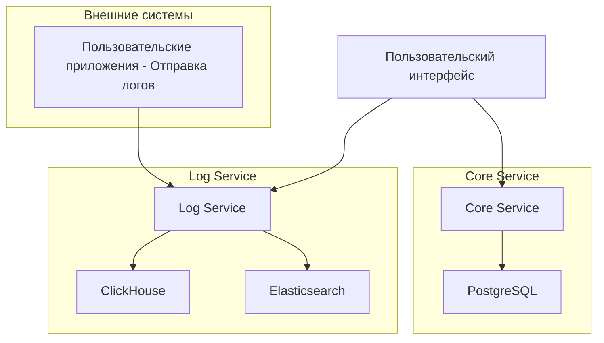

# Архитектура LogBoard

## Обзор

LogBoard состоит из двух основных микросервисов, которые работают вместе для обеспечения полноценного решения для логирования:

1. **Core Service** - Отвечает за управление пользователями, аутентификацию и управление проектами
2. **Log Service** - Отвечает за прием логов, их хранение и анализа, операции поиска

## Диаграмма системной архитектуры

## Сервисы

### Core Service

**Обязанности:**
- Аутентификация и авторизация пользователей
- Управление профилями пользователей
- Создание и управление проектами
- Генерация и управление API ключами

**Хранение данных:**
- База данных PostgreSQL для всех реляционных данных

**Технологии:**
- Spring Boot
- PostgreSQL
- JWT для аутентификации

### Log Service

**Обязанности:**
- Прием логов от клиентских приложений
- Хранение и извлечение логов
- Поиск и фильтрация логов
- Аналитика и агрегация логов

**Хранение данных:**
- ClickHouse для хранения логов 
- Elasticsearch для поиска и индексации логов

**Технологии:**
- Spring Boot
- ClickHouse
- Elasticsearch

## Слоистая архитектура

Оба сервиса следуют шаблону слоистой архитектуры для обеспечения разделения ответственности и удобства сопровождения.
