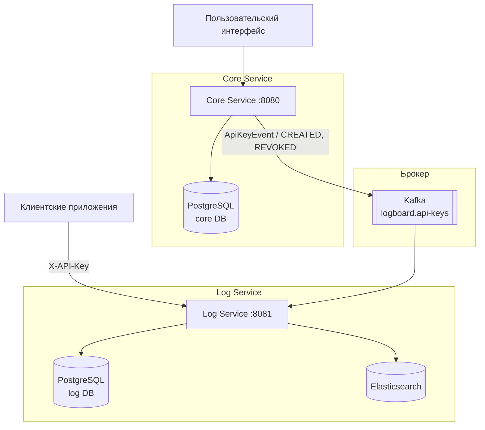

# Архитектура LogBoard

## Обзор

LogBoard состоит из двух микросервисов:

1. **Core Service** (`core/`, порт 8080) — управление пользователями, аутентификация, проекты, API ключи
2. **Log Service** (`log-service/`, порт 8081) — приём логов, хранение, поиск и аналитика

## Диаграмма системной архитектуры



## Интеграция сервисов через Kafka

Сервисы не используют общую базу данных. Core публикует события в Kafka; Log Service консьюмит их и хранит локальные реплики только тех данных, которые нужны для работы.

| Топик | Событие | Когда публикует Core | Что делает Log Service |
|---|---|---|---|
| `logboard.api-keys` | `CREATED` | Создание API ключа | Сохраняет запись в `local_api_keys`, кладёт в Caffeine-кэш |
| `logboard.api-keys` | `REVOKED` | Отзыв API ключа | Вытесняет запись из кэша, удаляет из `local_api_keys` |

### Почему Kafka, а не синхронный вызов

- Log Service имеет более высокий RPS чем Core (инжест логов — автоматизированный трафик)
- Валидация API ключа на горячем пути не должна зависеть от доступности Core
- Отзыв ключа распространяется за ~100ms (Kafka latency), а не через TTL кэша

## Сервисы

### Core Service

**Обязанности:**
- Аутентификация и авторизация пользователей (JWT в HTTP-only cookies)
- Создание и управление проектами
- Управление участниками проекта (роли OWNER / ADMIN / READER)
- Генерация и управление API ключами
- Публикация событий об API ключах в Kafka

**Технологии:**
- Spring Boot 3.2, Kotlin 2.0
- PostgreSQL (Spring Data JPA + Liquibase)
- JWT (JJWT 0.11.5, HS512, HttpOnly cookies)
- Apache Kafka (Spring Kafka producer)

### Log Service

**Обязанности:**
- Приём логов от клиентских приложений (аутентификация по API ключу)
- Хранение и поиск логов в Elasticsearch
- Потребление Kafka-событий об API ключах → локальная реплика для валидации

**Технологии:**
- Spring Boot 3.2, Kotlin 2.0
- PostgreSQL (Spring Data JPA + Liquibase) — локальные реплики
- Elasticsearch — хранение и поиск логов
- Apache Kafka (Spring Kafka consumer)
- Caffeine — in-process кэш локальных API ключей

## Слоистая архитектура

Оба сервиса следуют одинаковому шаблону:

```
Controller → Service → Repository → PostgreSQL / Elasticsearch
```

Подробная архитектура каждого сервиса:
- [Core Service](core/architecture.md)
- [Log Service](log-service/architecture.md)
