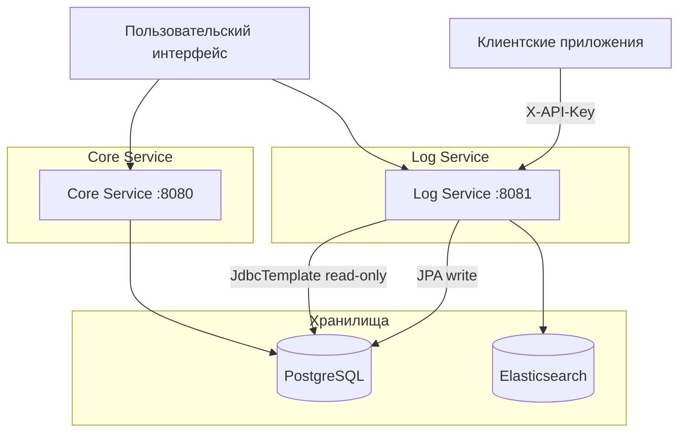

# Архитектура LogBoard

## Обзор

LogBoard состоит из двух основных микросервисов, которые работают вместе для обеспечения полноценного решения для логирования:

1. **Core Service** (`core/`, порт 8080) — управление пользователями, аутентификация, управление проектами и API ключами
2. **Log Service** (`log-service/`, порт 8081) — приём логов, хранение в Elasticsearch, поиск и аналитика

## Диаграмма системной архитектуры



## Модель данных и разделение ответственности

### Общая база данных PostgreSQL

Оба сервиса используют **одну** базу данных PostgreSQL, но с чётким разделением:

| Таблица | Владелец | Log Service |
|---|---|---|
| `users` | Core (JPA) | — |
| `projects` | Core (JPA) | — |
| `project_members` | Core (JPA) | read-only via JdbcTemplate |
| `api_keys` | Core (JPA) | read-only via JdbcTemplate |
| `ingestion_status` | **Log Service** (JPA + Liquibase) | read/write |

Log Service не имеет JPA-сущностей для таблиц Core — только plain SQL-запросы через `JdbcTemplate`.

### Elasticsearch

Используется исключительно Log Service для хранения и поиска логов. Индекс `logs` создаётся автоматически при первом запуске.

## Сервисы

### Core Service

**Обязанности:**
- Аутентификация и авторизация пользователей (JWT в HTTP-only cookies)
- Управление профилями пользователей
- Создание и управление проектами
- Управление участниками проекта (роли OWNER / ADMIN / READER)
- Генерация и управление API ключами

**Технологии:**
- Spring Boot 3.2, Kotlin 2.0
- PostgreSQL (Spring Data JPA + Liquibase)
- JWT (JJWT 0.11.5, HS512, HttpOnly cookies)

### Log Service

**Обязанности:**
- Приём логов от клиентских приложений (аутентификация по API ключу)
- Асинхронная запись логов в Elasticsearch (`@Async`)
- Полнотекстовый поиск и фильтрация логов с cursor-based пагинацией
- Аналитика: timeline через Elasticsearch date_histogram агрегации

**Технологии:**
- Spring Boot 3.2, Kotlin 2.0
- Elasticsearch 8.x (Spring Data Elasticsearch + нативный ES Java Client)
- PostgreSQL (JdbcTemplate для чтения + Spring Data JPA для `ingestion_status`)
- JWT (shared secret с Core, валидация входящих запросов)

## Аутентификация

| Клиент | Сервис | Механизм |
|---|---|---|
| Браузер / фронтенд | Core Service | JWT в HTTP-only cookie `access_token` |
| Браузер / фронтенд | Log Service `/logs/search`, `/logs/timeline` | Тот же JWT cookie (shared secret) |
| Клиентское приложение | Log Service `/logs/ingest` | Заголовок `X-API-Key` |

## Слоистая архитектура

Оба сервиса следуют одинаковому шаблону:

```
Controller → Service → Repository → PostgreSQL / Elasticsearch
```

Подробная архитектура каждого сервиса:
- [Core Service](core/architecture.md)
- [Log Service](log-service/architecture.md)
