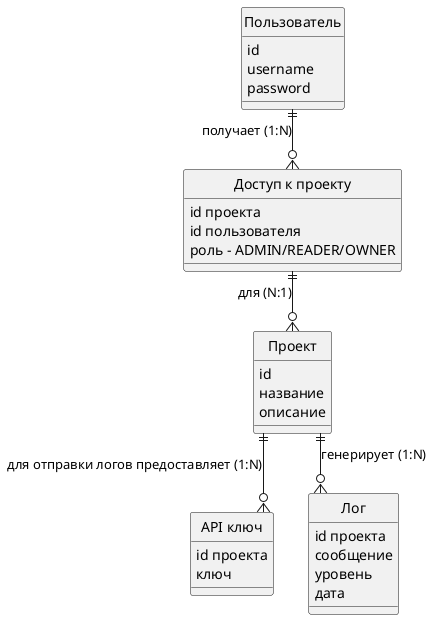

# ER-диаграмма

```plantuml
@startuml
skinparam linetype ortho
skinparam packageStyle rectangle
hide circle

entity "Пользователь" as user {
  id
  username
  password
}

entity "Доступ к проекту" as role {
  id проекта
  id пользователя
  роль - ADMIN/READER/OWNER
}

entity "Проект" as project {
  id 
  название
  описание
}

entity "API ключ" as api_key {
  id проекта
  ключ 
}

entity "Лог" as log {
  id проекта
  сообщение 
  уровень
  дата 
}

user ||--o{ role : "получает (1:N)"
role ||--o{ project : "для (N:1)"
project ||--o{ api_key : "для отправки логов предоставляет (1:N)"
project ||--o{ log : "генерирует (1:N)"
@enduml
```